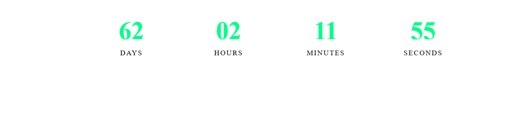

# New Year Countdown

A sleek and modern countdown timer that displays the time remaining until the next New Year. Built with vanilla JavaScript, HTML, and CSS.

## Features

- Real-time countdown to the next January 1st
- Displays days, hours, minutes, and seconds
- Modern glass-morphism design
- Responsive layout
- Smooth animations
- Dark theme with gradient background

## Demo

[Live Demo](your-demo-link-here)

## Technologies Used

- HTML5
- CSS3
- JavaScript
- Google Fonts (Poppins)
- Font Awesome Icons

## Usage

The countdown automatically starts when the page loads. It will calculate and display the time remaining until the next January 1st, updating every second.

## Customization

You can customize the appearance by modifying the CSS variables in `styles.css`:

- Change the background gradient colors
- Modify the countdown box styling
- Adjust the font sizes
- Update the color scheme

## Contributing

1. Fork the repository
2. Create your feature branch (`git checkout -b feature/AmazingFeature`)
3. Commit your changes (`git commit -m 'Add some AmazingFeature'`)
4. Push to the branch (`git push origin feature/AmazingFeature`)
5. Open a Pull Request

## License

This project is licensed under the MIT License - see the [LICENSE](LICENSE) file for details.
